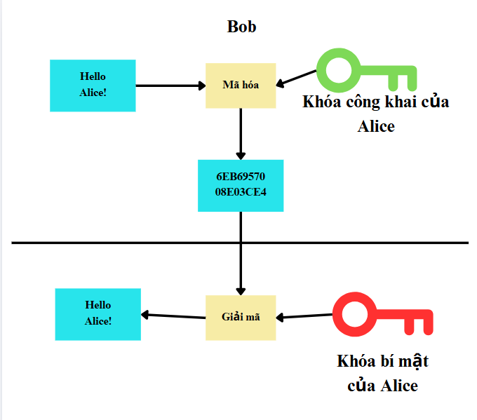
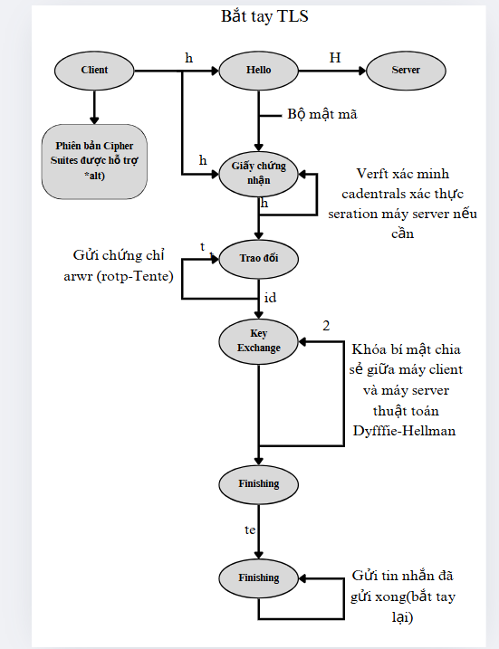
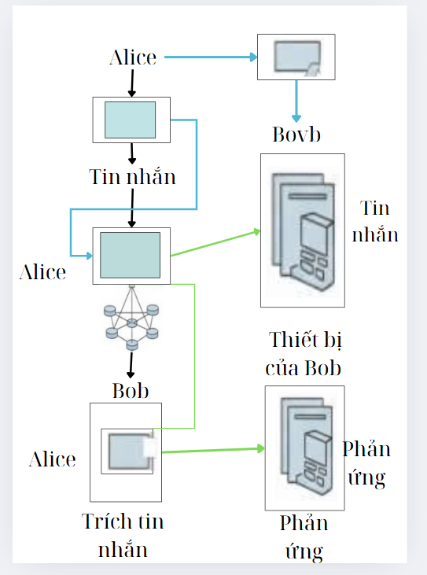
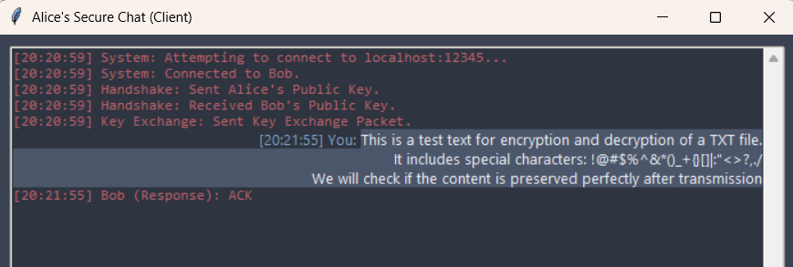
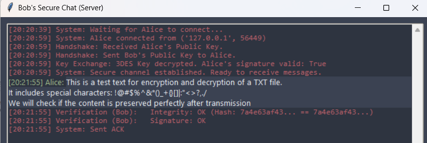

1.GIỚI THIỆU

Trong bối cảnh công nghệ phát triển, nhu cầu truyền tải tin nhắn văn bản nhanh chóng và an toàn trở nên cấp thiết. Tuy nhiên, việc thiếu biện pháp bảo mật khiến tin nhắn có thể bị chặn, đọc trộm, giả mạo hoặc chỉnh sửa.

Đề tài này xây dựng một hệ thống nhắn tin bảo mật với các mục tiêu:
- Bảo mật nội dung tin nhắn bằng TripleDES.
- Xác thực người gửi/người nhận bằng chữ ký số RSA 2048-bit.
- Đảm bảo tính toàn vẹn bằng SHA-256.
- Hệ thống hoạt động mô phỏng trên mô hình P2P.

2.TRÌNH BÀY KỸ THUẬT

a.Kiến trúc hệ thống
- Mô hình: Client–Server (Alice & Bob), mô phỏng truyền tin nhắn an toàn.
- Quy trình truyền tin:
  - Handshake: trao đổi khóa RSA.
  - Trao đổi khóa phiên 3DES (mã hóa bằng RSA).
  - Truyền tin an toàn: mã hóa bằng 3DES, kèm chữ ký số.

  
  

  
  

b.Thành phần kỹ thuật

Thuật toán & công nghệ:
- Mã hóa TripleDES
  - Mã hóa đối xứng, chế độ CBC, đệm PKCS7.
  - IV mới được tạo ngẫu nhiên cho từng tin nhắn.
- Xác thực RSA
  - Người gửi ký SHA-256 bằng khóa riêng.
  - Người nhận dùng khóa công khai xác minh chữ ký.
- Hàm băm SHA-256
  - Tạo dấu vân tay của (IV || ciphertext) để đảm bảo toàn vẹn.

  
  

c.Các module chính
- crypto_utils.py: thư viện mật mã.
- chat_server.py: logic & GUI của Bob.
- chat_client.py: logic & GUI của Alice.
- Giao diện đồ họa xây dựng bằng tkinter, xử lý mạng với socket + threading.

d.Thử nghiệm & kết quả
- Thử nghiệm với văn bản (text) thành công.
- Tốc độ handshake và gửi/nhận nhanh, chính xác.
- Tin nhắn được mã hóa & giải mã đúng, toàn vẹn và xác thực.

  
  

